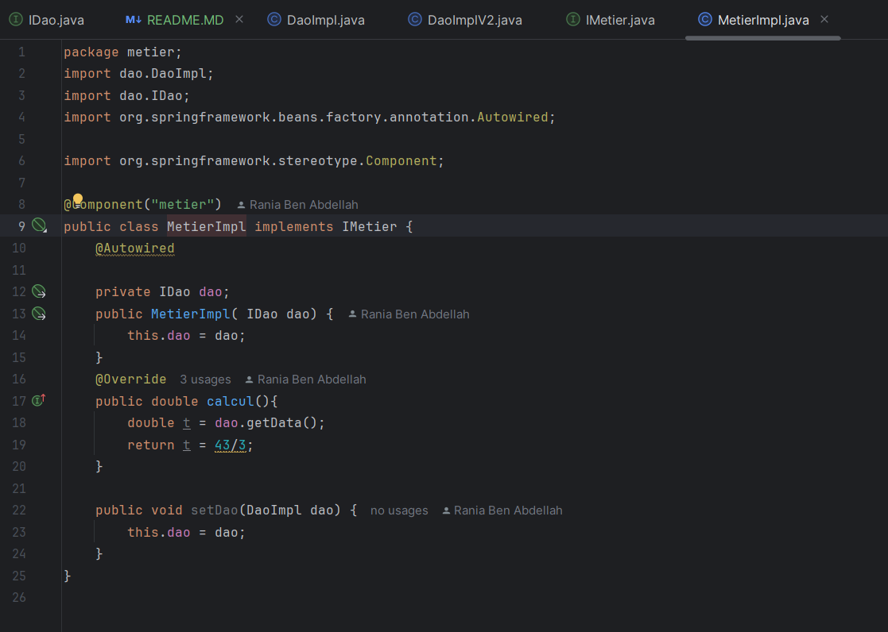

<h2> Compte rendu du devoir N°1</h2>
<h1> 1-Diagramme de classe </h1>
<h1> Voici le diagramme de classe  </h1>

<h1> Voici l'architecture de mon projet </h1>

<h1>  voici l'interface IDao avec une méthode getData</h1>

<h1>  voici l'implementation de cette interface </h1>

<h1>  voici l'implementation V2</h1>

<h1>  voici l'interface IMetier avec une méthode calcul </h1>

<h1>  voici l'implementation de cette interface </h1>

<h1>voici l'injection des dépendances par instanciation statique</h1>

<h1>voici l'injection des dépendances par instanciation dynamique</h1>

<h1>voici l'injection en utilisant le Framework Spring Version XML </h1>

<h1> voici l'injection en utilisant le Framework Spring annotation</h1>

<h1>voici le config.xml</h1>

<h1> voici le pom.xml</h1>

<h1> voici la sortie web service </h1>

<h1> voici la sortie base de donnée </h1>
